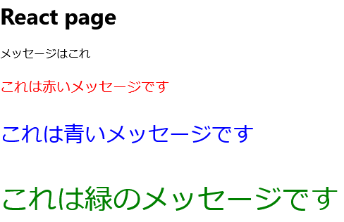

# Reactメモ

[node.js](https://nodejs.org/en/download/)
[参考書](https://amzn.asia/d/5sRolG0)

## コマンド

nodeのバージョンを確認する

```sh
node --version
```

npmバージョンを確認する

```sh
npm -v
```

## Start Project

react_appという名前のプロジェクトを作成する

```sh
npx create-react-app react_app
```

プロジェクト操作系のコマンド

| コマンド | 操作 |
| --- | --- |
| yarn start | 開発サーバーを用いてプログラムを実行する |
| yarn build | プロジェクトのビルド。実際にサーバーにデプロイするファイルを生成する |
| yarn test | テストプログラムの実行 |
| yarn eject | プロジェクトの依存関係をプロジェクト内に移動させ、完全に独立させた形で扱えるようにする |

[引用](https://zenn.dev/web_tips/articles/abad1a544f3643)

## React

### chapter1

#### CDNでReactを読み込む

[ディレクトリ](react_init)
CDN ... Content Delivery Network

```html
<!DOCTYPE html>
<html>
    <head>
        <meta charset="utf-8">
        <meta http-equiv="X-UA-Compatible" content="IE=edge" />
        <meta name="viewport" content="width=device-width, initial-scale=1" />
        <title>Simple React App No JSC by SDN</title>
        <script type="module">
            import React from "https://esm.sh/react@19.0.0-rc-14a4699f-20240725";
            import ReactDOMClient from "https://esm.sh/react-dom@19.0.0-rc-14a4699f-20240725/client";
        </script>
    </head>
    <body>
        <h1>React</h1>
        <div id="root">wait...</div>
    </body>
</html>
```

importの構文

```javascript
import React from ファイルの指定
import ReactDOM from ファイルの指定
```

#### DOM(Document Object Model)

DOM...HTMLの要素をjavascriptから操作出来るようにするもの

DOMでは要素を１つ１つ更新するため速度が担保できない -> ReactDOMで高速化している

ReactDOM ... 更新するベースとなるReactDOMを用意し、エレメントを操作する。それぞれの値を更新し処理が終了したらレンダリングする。

1, webページにあるエレメントからReact DOMのエレメントを作成する
2, ReactDOMのエレメントを使って表示を操作する
3, ReactDOMエレメントをレンダリングしてWebページの表示を更新する。

- ルートエレメントの作成

```javascript
変数 = RectDOMClient.createRoot(エレメント);
```

- エレメントの作成

```javascript
変数 = React.createElement(要素名, オプション, コンテンツ);
```

オプションではcssの設定などに使うらしい

- レンダリング

```javascript
ルート.render(Reactエレメント);
```

example

```javascript
// div id="root" の取得
const root = document.getElementById("root");
// ルートエレメントの作成
// HTML の div id="root" に対して Reactのルート(ベース)を作成
const rootElement = ReactDOMClient.createRoot(root);
// <p>Hello World</p> の作成
const element = React.createElement('p', {}, "Hello World");
// ルートエレメントにレンダリング
rootElement.render(element);
```

##### javascriptを別ファイルに分ける

[main.js](react_init\main.js)

```javascript
// Reactのバージョン
const version = '19.0.0-rc-14a4699f-20240725';

// moduleをimportする
async function init() {
    // Reactのロード
    const module1 = await import('https://esm.sh/react@${version}');
    // Reactの取得
    // windowとしているのは読み込んでいるwindow自体に適用するため
    window.React = module1.default;
    // ReactDOMClientのロード
    const module2 = await import('https://esm.sh/react-dom@${version}/client');
    // ReactDOMClientの取得
    window.ReactDOMClient = module2.default;
    // メインプログラムの実行
    main();
}

// mainプログラム
function main() {
    const root = document.getElementById('root');
    const rootElement = ReactDOMClient.createRoot(root);
    const h2 = React.createElement('h2', null, 'Sample application');
    const p = React.createElement('p', {}, 'これはReactのサンプルコードです');
    const div = React.createElement('p', {}, [h2, p]);
    rootElement.render(div);
}

// 初期化の実行
init();
```

- モジュールの読み込みは非同期処理のため、init関数も非同期関数としておく

モジュールのロード

```javascript
変数 = await import(スクリプトファイルの指定);
```

Reactの取得 (今回の場合はデフォルト機能を使うため「.default」)

```javascript
変数 = モジュール.default;
```

### capter2

#### Reactプロジェクトの実行

P50にある

編集したときは一旦サーバーを停止して、毎回下記コマンドを実行しないと変更が反映されない

```bash
npx eslint --cache --cache-location node_modules/.cache/.eslintcache --fix
```

#### Reactプロジェクトの作成

| ビルドコマンド | 特徴 | 利点 | 用途 |
| --- | --- | --- | --- |
| Create React App | Facebookが提供している | 設定が容易 | 小規模～中規模 |
| Vite | 高速なビルドツールで開発サーバーの起動が速い | 設定が容易 | 開発速度重要/モダンな開発環境に適している |
| Webpack | 柔軟なモジュールハンドラー | 細かい設定が可能 | 大規模開発/高度なカスタマイズが必要な場合に適している |
| Node.js | サーバーサイドのjavascript環境 | サーバーとクライアントとコード統一が出来る。 | フルスタック開発、サーバーサイドレンダリングが適している |

> バックエンドがdjangoの場合、フロントエンドはどのビルドが適しているか？
>> Create React App: 簡単に始めたい場合に最適。
>> Vite: 高速な開発体験を求める場合に最適。
>> Webpack: 高度なカスタマイズが必要な場合に最適。
>> Node.js: フルスタック開発やSSRが必要な場合に最適。

#### プロジェクト構成ファイル

- フォルダー

| フォルダー名 | 説明 |
| --- | --- |
| node_modules | npmで管理されているモジュール類をまとめている |
| public | HTMLやcssなど公開されるファイルをまとめている |
| src | Reactで作成したファイルをまとめている |

- ファイル

| ファイル名 | 説明 |
| --- | --- |
| package.json | npmでパッケージ管理するファイル |
| package-lock.json | npmの設定を記述したファイル |
| tsconfig.json | TypeScriptの設定ファイル |

### Chapter 3

[TypeScriptプロジェクト](https://github.com/Cell1729/study-typescript-react)

#### JSX(TSX)

JSX
> JavaScript XMLの略
> JavaScript内でHTMLの記述を可能にする文法拡張

例えば要素をまとめて表示することが出来る

```javascript
import React from 'react';
import ReactDOMClient from 'react-dom/client';

const root = document.getElementById('root');
const rootElement = ReactDOMClient.createRoot(root);

// const h1 = React.createElement('h1', {}, 'Hello World');
// const p = React.createElement('p', {}, 'This is React sample application');
// const div = React.createElement('div', {}, h1, p);

const element = (
    <div>
        <h1>Hello World</h1>
        <p>This is React sample application</p>
        <p>エレメントを固めて表示</p>
    </div>
);

rootElement.render(element);
```

cssやclassを当てたい場合のindex.js

```javascript
import React from 'react';
import ReactDOMClient from 'react-dom/client';
import './index_style.css'; // 追加

const root = document.getElementById('root');
const rootElement = ReactDOMClient.createRoot(root);

// const h1 = React.createElement('h1', {}, 'Hello World');
// const p = React.createElement('p', {}, 'This is React sample application');
// const div = React.createElement('div', {}, h1, p);

const element = (
    <div className="container">
        <h1>Hello World</h1>
        <p>This is React sample application</p>
        <p>エレメントを固めて表示</p>
    </div>
);

// rootElement.render(div);
rootElement.render(element);
```

#### コンポーネントの利用

コンポーネントの概念
> 要素の作成を毎回1つのファイルに書くのは管理がしにくい
> -> 部品ごとにファイルを作成しよう (コンポーネント)

下記例では```Msg```関数の呼び出された回数だけ```メッセージはこれ```が表示される。これがコンポーネント。

```javascript
import React from 'react';
import logo from './logo.svg';
import './App.css';

const title = "React page";
const message = "メッセージはこれ";

function Msg(){
  return <p className='msg'>Hello This is Conponent</p>
}

function App() {
  return (
    <div className="container">
      <h1>{title}</h1>
      <p>{message}</p>
      <Msg />
      <Msg />
      <Msg />
      <Msg />
  </div>
  );
}

export default App;
```

```export default App;```ではファイルをインポートしたときに呼び出せるコンポーネントを定義出来る
更にコンポーネントに引数を持たせる

```javascript
import React from 'react';
import logo from './logo.svg';
import './App.css';

const title = "React page";
const message = "メッセージはこれ";

function Msg(msg: string, size: number, color: string) {
  const msgStyle = {
    fontSize: size,
    color: color
  }
  return <p className='msg' style={msgStyle}>{msg}</p>
}

function App() {
  return (
    <div className="container">
      <h1>{title}</h1>
      <p>{message}</p>
      <div>
        {Msg('これは赤いメッセージです', 20, 'red')}
        {Msg('これは青いメッセージです', 30, 'blue')}
        {Msg('これは緑のメッセージです', 40, 'green')}
      </div>
  </div>
  );
}

export default App;
```



> ```<div>```で囲う理由はレンダリング出来るのは1つだけだから、固まらせるため

さらに属性を持たせて書きやすくする

```javascript
import React from 'react';
import logo from './logo.svg';
import './App.css';

const title = "React page";
const message = "メッセージはこれ";

// MsgProps型を定義
type MsgProps = {
  msg: string,
  size: number,
  color: string
}

function Msg(props: MsgProps) {
  const msgStyle = {
    fontSize: props.size,
    color: props.color
  }
  return <p className='msg' style={msgStyle}>{props.msg}</p>
}

function App() {
  return (
    <div className="container">
      <h1>{title}</h1>
      <p>{message}</p>
      <div>
        <Msg msg={'これは赤いメッセージです'} size={20} color={'red'}/>
        <Msg msg={'これは青いメッセージです'} size={30} color={'blue'} />
        <Msg msg={'これは緑のメッセージです'} size={40} color={'green'} />
      </div>
    </div>
  );
}

export default App;
```

#### JSXの構文

##### 条件分岐

- 基本的な構文

```javascript
{ 真偽値 && JSXの記述}
```

- 条件分岐により表示切替

```javascript
{ 真偽値? TRUE処理 : FALSE処理 }
```

##### 繰り返し処理

mapメソッド
> 元の配列から新しい配列を作成することが出来るメソッド

```javascript
配列.map(value => 新しい項目)
```

> ```=>```について
> アロー関数...関数を簡略して書いた物
>> ```引数 => 返り値```

ex

```javascript
let A = [1, 2, 3];
let B = A.map(value => value*2);
// このときBには[2, 4, 6]が入っている
```

これを踏まえてhtmlに表示する

```javascript
const data = [
    {name:'Taro', mail:'taro@yamada', age:45},
    {name:'Hanako', mail:'hanako@flower', age:80},
    {name:'sachiko', mail:'sachiko@happy', age:256},
    {name:'Kimu', mail:'kimu@ti', age:3},
]

// html
function App(){
    return (
        <div className='container'>
            <thead>
                <tr>
                    <th>name</th>
                    <th>mail</th>
                    <th>age</th>
                </tr>
            </thead>
            <tbody>
                {data.map(value=>
                    <tr>
                        <td>{value.name}</td>
                        <td>{value.mail}</td>
                        <td>{value.age}</td>
                    </tr>
                )}
            </tbody>
        </div>
    )
}

export default App
```

##### オブジェクトを記述

```javascript
属性 = {{内容}}
```

Ex

```javascript
interface DataInterface {
    data :{
        name : string,
        mail : string,
        age : number,
    }
}

function Data(props : DataInterface) {
    retrun (
        <p className='msg'>
            {prps.data.name} - {props.data.age} - {props.data.mail}
        </p>
    );
}

function App() {
    return (
        <div calssName='container'>
            <Data data={{name:'taro', mail:'taro@yamada', age:53}} />
        </div>
    )
}
```

```<Data data={{name:'taro', mail:'taro@yamada', age:53}} />```このように渡すと下記のように毎回代入しなくて済む

```javascript
interface DataInterface {
  data: {
    name: string;
    mail: string;
    age: number;
  };
}

function Data(props: DataInterface) {
  return (
    <p className='msg'>
      {props.data.name} - {props.data.age} - {props.data.mail}
    </p>
  );
}

function App() {
  const userData = { name: 'taro', mail: 'taro@yamada', age: 53 };

  return (
    <div className='container'>
      <Data data={userData} />
    </div>
  );
}

export default App;
```

##### アロー関数

括弧で括った関数を直ぐ実行する

```javascript
( 関数 )()
```

表示を作成するようにするためには下記

```javascript
( ()=>{処理} )()
```

> アロー関数を即実行する処理

#### 複数のコンポーネントを利用する

コンポーネントに値ではなくコンテンツを渡す

```javascript
function Msg(props: {children: string}) {
    return {
        <div className="msg">
            {props.children}
        </div>
    };
}

function App() {
    return (
        <div className='container'>
            <Msg>
                1行目
                2行目
            </Msg>
        </div>
    );
}
```

他にもhtmlタグを渡すことが出来る

```javascript
function Msg(props: {children:Array<any>}) {
    return (
        <ol className="msg">
            {props.children.map((child: any) => {
                return <li style={{margin:"10px 50px"}}>
                    {child.props.children}
                </li>;
            })}
        </ol>
    );
}

function App() {
    return (
        <div className='container'>
            <Msg>
                <p>1行目</p>
                <p>2行目</p>
                <p>3行目</p>
            </Msg>
        </div>
    );
}
```

#### 別ファイルにコンポーネントの記述方法

書き方

```javascript
imoprt React from 'react';

function コンポーネント名() {
    処理
}

export default コンポーネント名
```

実際に使う方法

```javascript
import コンポーネント名 from 'path';
```

#### 子コンポーネントから親コンポーネントへ値を渡す

Example:

```javascript
import React from 'react';
import logo from './logo.svg';
import './App.css';

const title = "React page";
const message = "メッセージはこれ";

interface MsgProps {
  message: string;
  callback: (msg:string) => void;
}

function Msg(props : MsgProps) {
    props.callback("メッセージが返されました");
    return (
      <div className='msg'>
        {props.message}
      </div>
    );
}

function App() {
  let callback = "none";
  return (
      <div className='container'>
        <h1>{title}</h1>
        <Msg message={message} callback = {(msg : string) => {
          callback = msg;
          console.log(callback);
          alert("callback" + callback);
        }}/>
      </div>
  );
}

export default App;
```

1, オブジェクトを作成する。今回の場合```MsgProps```には```message```と```callback```関数を持つ。```callback```関数にはアロー関数で記述して即実行出来るようにする。

```javascript
interface MsgProps {
  message: string;
  callback: (msg:string) => void;
}
```

> voidで返り値の関数として記述

2, ```Msg```コンポーネント
```props.callback("メッセージが返されました");```で```callback```にテキストを代入
```return```処理でhtmlにメッセージを表示

```javascript
function Msg(props : MsgProps) {
    props.callback("メッセージが返されました");
    return (
      <div className='msg'>
        {props.message}
      </div>
    );
}
```

3, ```App```コンポーネント

```Msg```関数を呼び出し、値を渡す。アロー関数記述をしているため```Msg```関数を呼び出した時点で```alert```を表示するようにしている。

```javascript
function App() {
  let callback = "none";
  return (
      <div className='container'>
        <h1>{title}</h1>
        <Msg message={message} callback = {(msg : string) => {
          callback = msg;
          console.log(callback);
          alert("callback" + callback);
        }}/>
      </div>
  );
}
```

親コンポーネント(App)は子コンポーネント(Msg)からテキストを受け取りalertとして表示している

#### 表示の更新とイベント

##### 表示を更新する

1秒間に一度カウントを増やす
App.tsx

```javascript
import React from 'react';
import logo from './logo.svg';
import './App.css';

const title = "React page";
const message = "メッセージはこれ";

function App(props: {counter? : number}) {
  return (
    <div className='container'>
      <h1>{title}</h1>
      <h2>{message}</h2>
      <h5 className="msg">
        count : {props.counter || 0}
      </h5>
    </div>
  );
}

export default App;
```

index.tsx

```javascript
import React from 'react';
import ReactDOM from 'react-dom/client';
import './index.css';
import App from './App';
import reportWebVitals from './reportWebVitals';

var counter = 0;

setInterval(() => {
  counter += 1;
  root.render(
    <React.StrictMode>
      <App counter={counter} />
    </React.StrictMode>
  );
}, 1000);

const root = ReactDOM.createRoot(
  document.getElementById('root') as HTMLElement
);
root.render(
  <React.StrictMode>
    <App counter={counter}/>
  </React.StrictMode>
);

// If you want to start measuring performance in your app, pass a function
// to log results (for example: reportWebVitals(console.log))
// or send to an analytics endpoint. Learn more: https://bit.ly/CRA-vitals
reportWebVitals();
```

index.tsxでタイマーを使い定期的にrenderを実行する
App.tsxはコンポーネント(部品)でinex.tsxでルート(表示)をしている。

```javascript
setInterval(() => {
  counter += 1;
  root.render(
    <React.StrictMode>
      <App counter={counter} />
    </React.StrictMode>
  );
}, 1000);
```

index.tsxで1秒ごとに+1してからAppコンポーネントを呼び出しcounterを代入している。

##### クリックして更新する

App.tsx

```javascript
import React from 'react';
import logo from './logo.svg';
import './App.css';

const title = "React page";
const message = "メッセージはこれ";

function App(props: {counter? : number,
  onClick? : () => void}) {
  return (
    <div className='container'>
      <h1>{title}</h1>
      <h2>{message}</h2>
      <h5 className="msg" onClick={props.onClick}>
        count : {props.counter || 0}.
      </h5>
    </div>
  );
}

export default App;
```

index.tsx

```javascript
import React from 'react';
import ReactDOM from 'react-dom/client';
import './index.css';
import App from './App';
import reportWebVitals from './reportWebVitals';

const root = ReactDOM.createRoot(
  document.getElementById('root') as HTMLElement
);

let counter = 0;

const doAction = () => {
  counter++;
  render();
}

function render() {
  root.render(
    <React.StrictMode>
      <App onClick={doAction} counter={counter} />
    </React.StrictMode>
  );
}

// If you want to start measuring performance in your app, pass a function
// to log results (for example: reportWebVitals(console.log))
// or send to an analytics endpoint. Learn more: https://bit.ly/CRA-vitals
reportWebVitals();
render();
```

App.tsxはコンポーネントで、counterとonClickを受け取りcounterの表示と

```html
<h5 className="msg" onClick={props.onClick}>
```

でclickイベントの処理をしている。index.tsxでAppコンポーネントを表示し、クリックに対するアクション```doAction```関数でcounter+1、表示関数を呼び出している。```render```関数でAppコンポーネントを更新し、表示している。
